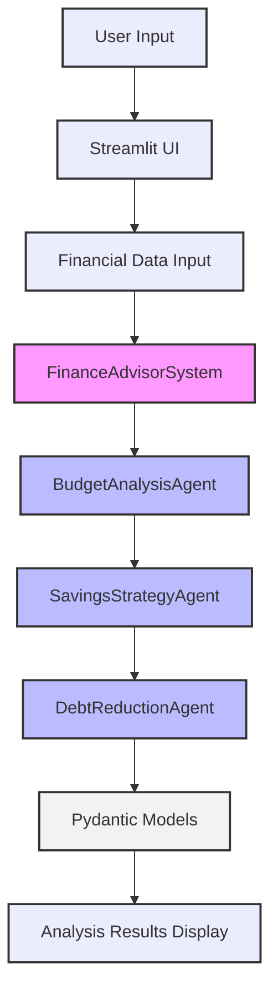

# AI Financial Coach 

Demo by [ONE-FRONT](https://www.one-front.com)

The **AI Financial Coach** is a personalized financial advisor powered by Google's ADK (Agent Development Kit) framework. This app provides comprehensive financial analysis and recommendations based on user inputs including income, expenses, debts, and financial goals.

## Table of Contents
- [AI Financial Coach](#ai-financial-coach)
  - [Table of Contents](#table-of-contents)
  - [Project Architecture](#project-architecture)
  - [Agent Breakdown](#agent-breakdown)
  - [Features](#features)
  - [`agent.py` Structure](#agentpy-structure)
  - [How to Run](#how-to-run)
  - [CSV File Format](#csv-file-format)
  - [Key Components](#key-components)
    - [`FinanceAdvisorSystem` Class](#financeadvisorsystem-class)
    - [Agents](#agents)
    - [Pydantic Models](#pydantic-models)
  - [Future Enhancements](#future-enhancements)

## Project Architecture

The AI Financial Coach operates on a multi-agent system orchestrated by the `FinanceAdvisorSystem`. User inputs are processed through a series of specialized AI agents, each focusing on a distinct aspect of financial analysis. The agents communicate and build upon each other's outputs, utilizing Pydantic models to ensure structured data flow.



## Agent Breakdown

The core intelligence of the application resides in a **SequentialAgent** system, where each agent processes information and passes its refined output to the next, ensuring a comprehensive financial assessment.

- **`BudgetAnalysisAgent`**:
  - **Purpose**: The initial agent responsible for a detailed review of financial transactions and expenses.
  - **Tasks**: Analyzes income and spending, categorizes expenses, identifies patterns, and suggests areas for budget improvements with quantified potential savings.
  - **Model**: `gemini-2.0-flash-exp`
  - **Output**: Generates a `BudgetAnalysis` object, which is stored in `state['budget_analysis']`.

- **`SavingsStrategyAgent`**:
  - **Purpose**: Builds upon the budget analysis to formulate personalized savings plans.
  - **Tasks**: Reviews the `budget_analysis`, calculates optimal emergency fund size, suggests savings allocations for various purposes, and recommends automation techniques for consistent saving.
  - **Model**: `gemini-2.0-flash-exp`
  - **Output**: Creates a `SavingsStrategy` object, stored in `state['savings_strategy']`.

- **`DebtReductionAgent`**:
  - **Purpose**: The final agent, focusing on optimizing debt payoff to minimize interest and accelerate debt freedom.
  - **Tasks**: Analyzes debts (interest rate, balance, minimum payments), creates prioritized payoff plans (avalanche and snowball methods), calculates total interest paid and time to debt freedom, and suggests strategies like consolidation or refinancing.
  - **Model**: `gemini-2.0-flash-exp`
  - **Output**: Produces a `DebtReduction` object, stored in `state['debt_reduction']`.

## Features

- **Multi-Agent Financial Analysis System**
    - Budget Analysis Agent: Analyzes spending patterns and recommends optimizations
    - Savings Strategy Agent: Creates personalized savings plans and emergency fund strategies
    - Debt Reduction Agent: Develops optimized debt payoff strategies using avalanche and snowball methods

- **Enhanced UI/UX**:
  - Centered main title and application tagline for improved aesthetics.
  - Prominent display of data privacy message ("All data is processed locally and not stored anywhere.").
  - Independent scrollable columns for sidebar, input forms, and analysis results, adapting to screen height.

- **Expense Analysis**:
  - Supports both CSV upload and manual expense entry.
  - Includes a "Download CSV Template" button for easy data preparation.
  - CSV transaction analysis with date, category, and amount tracking.
  - Visual breakdown of spending by category.
  - Automated expense categorization and pattern detection.

- **Savings Recommendations**:
  - Emergency fund sizing and building strategies.
  - Custom savings allocations across different goals.
  - Practical automation techniques for consistent saving.
  - Progress tracking and milestone recommendations.

- **Debt Management**:
  - Multiple debt handling with interest rate optimization.
  - Comparison between avalanche and snowball methods.
  - Visual debt payoff timeline and interest savings analysis.
  - Actionable debt reduction recommendations.

- **Interactive Visualizations**:
  - Pie charts for expense breakdown.
  - Bar charts for income vs. expenses.
  - Debt comparison graphs.
  - Progress tracking metrics.

## `agent.py` Structure

The `agent.py` file is the central hub of the application, responsible for both the Streamlit user interface and the orchestration of the AI agents. Its key sections include:

- **Pydantic Models**: Defines the data schemas (e.g., `BudgetAnalysis`, `SavingsStrategy`, `DebtReduction`) that structure the input and output of the AI agents, ensuring data consistency and validation.
- **`FinanceAdvisorSystem` Class**: This class initializes the `InMemorySessionService` and sets up the `LlmAgent` instances for budget analysis, savings strategy, and debt reduction. These individual agents are then combined into a `SequentialAgent` (`FinanceCoordinatorAgent`), which manages the flow of information between them. The `Runner` class is used to execute the agent sequence.
- **`analyze_finances` Method**: An asynchronous method within `FinanceAdvisorSystem` that takes financial data, creates a session, preprocesses transactions and manual expenses, runs the sequential agent, and retrieves the final analysis results.
- **Data Preprocessing Functions (`_preprocess_transactions`, `_preprocess_manual_expenses`)**: Helper methods to prepare user-provided financial data for agent consumption, including parsing CSV transactions and calculating category totals.
- **Display Functions (`display_budget_analysis`, `display_savings_strategy`, `display_debt_reduction`)**: These functions are responsible for rendering the structured output from the AI agents into user-friendly visualizations and text within the Streamlit UI.
- **Input Rendering Functions (`_render_income_and_dependants`, `_render_expenses_input`, `_render_debt_information`)**: Modular functions that create the interactive Streamlit widgets for users to input their financial data.
- **`main` Function**: The entry point of the Streamlit application. It configures the page settings, initializes Streamlit session state variables (for persisting data across reruns), checks for the Gemini API key, and lays out the main UI components using Streamlit columns and containers. It also contains the logic to trigger the financial analysis when the "Analyze Finances" button is clicked.

## How to Run

Follow the steps below to set up and run the application:

1. **Get API Key**:
   - Get a free Gemini API Key from Google AI Studio: https://aistudio.google.com/apikey
   - Create a `.env` file in the project root and add your API key:
     ```
     GOOGLE_API_KEY=your_api_key_here
     ```

2. **Clone the Repository**:
   ```bash
   git clone https://github.com/michaelwybraniec/mcp-financial-coach.git
   cd mcp-financial-coach
   ```

3. **Install Dependencies**:
   ```bash
   pip install -r requirements.txt
   ```

4. **Run the Streamlit App**:
   ```bash
   streamlit run agent.py
   # Alternatively, if running in a virtual environment:
   # source .venv/bin/activate && streamlit run agent.py
   ```

## CSV File Format

The application accepts CSV files with the following required columns:
- `Date`: Transaction date in YYYY-MM-DD format
- `Category`: Expense category
- `Amount`: Transaction amount (supports currency symbols and comma formatting)

Example:
```csv
Date,Category,Amount
2024-01-01,Housing,1200.00
2024-01-02,Food,150.50
2024-01-03,Transportation,45.00
```

A template CSV file can be downloaded directly from the application's sidebar.

## Key Components

### `FinanceAdvisorSystem` Class

This class orchestrates the various financial analysis agents. It initializes and manages the `BudgetAnalysisAgent`, `SavingsStrategyAgent`, and `DebtReductionAgent` as a sequential agent system.

### Agents

- **`BudgetAnalysisAgent`**:
  - Analyzes income, transactions, and expenses.
  - Categorizes spending and identifies patterns.
  - Recommends budget improvements and potential savings.
  - Uses `gemini-2.0-flash-exp` model.
  - Output schema: `BudgetAnalysis`.

- **`SavingsStrategyAgent`**:
  - Creates personalized savings plans.
  - Calculates optimal emergency fund size.
  - Suggests savings allocation and automation techniques.
  - Uses `gemini-2.0-flash-exp` model.
  - Output schema: `SavingsStrategy`.

- **`DebtReductionAgent`**:
  - Manages multiple debts and optimizes payoff strategies.
  - Compares avalanche and snowball methods.
  - Provides actionable debt reduction recommendations.
  - Uses `gemini-2.0-flash-exp` model.
  - Output schema: `DebtReduction`.

### Pydantic Models

The project heavily utilizes Pydantic for data validation and clear schema definition for agent outputs:

- `SpendingCategory`
- `SpendingRecommendation`
- `BudgetAnalysis`
- `EmergencyFund`
- `SavingsRecommendation`
- `AutomationTechnique`
- `SavingsStrategy`
- `Debt`
- `PayoffPlan`
- `PayoffPlans`
- `DebtRecommendation`
- `DebtReduction`

These models ensure structured and consistent data flow between the agents and the Streamlit UI.

## Future Enhancements

- **Database Integration**: Implement a database (e.g., SQLite, PostgreSQL) to persist user data, transaction history, and financial plans.
- **User Authentication**: Add user login and registration to allow multiple users to manage their finances securely.
- **Advanced Categorization**: Integrate with a more robust financial data API for automatic and intelligent transaction categorization.
- **Investment Planning Agent**: Develop a new agent to provide personalized investment advice based on user risk tolerance and financial goals.
- **Real-time Data Sync**: Connect to bank accounts or financial institutions for real-time transaction updates.
- **Mobile Responsiveness**: Optimize the Streamlit UI for better display and interaction on mobile devices.
